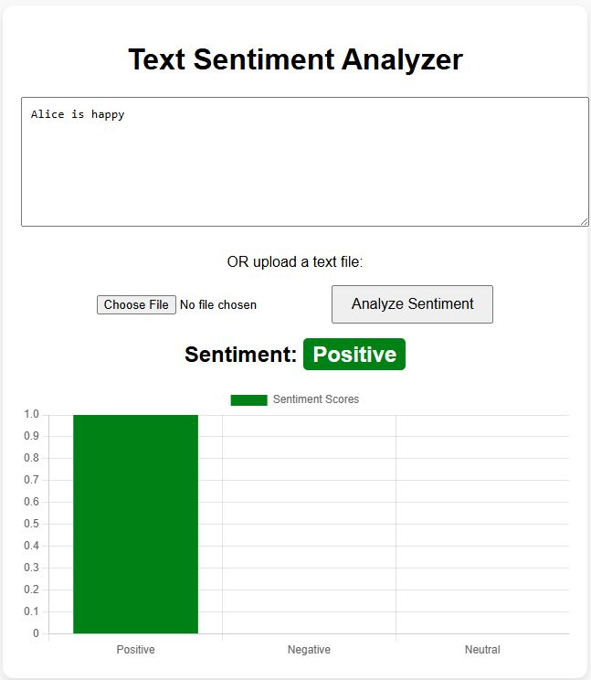
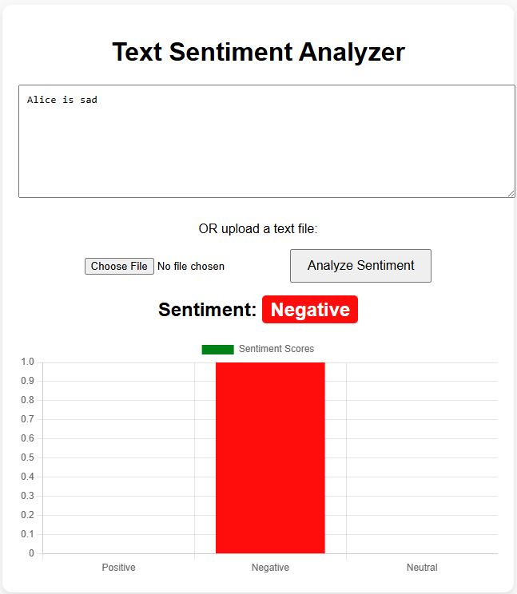

# Text Sentiment Analyzer (Flask + NLTK + Chart.js)

A full-stack web application that analyzes the sentiment of user-provided text using NLTK's VADER sentiment model and visualizes the result using Chart.js.

Users can either:
- Type text directly
- Upload a `.txt` file

The application processes the text, performs NLP preprocessing, classifies sentiment (Positive / Negative / Neutral), and displays the result in a bar chart.

---

## Tech Stack

**Frontend**
- HTML5
- CSS3
- JavaScript (ES6)
- Chart.js

**Backend**
- Python
- Flask

**NLP**
- NLTK
  - VADER Sentiment Analyzer
  - Word Tokenization
  - WordNet Lemmatizer

---

## Project Architecture
User Input (Text / File)
            ↓
JavaScript (Fetch API + FormData)
            ↓
Flask Backend (/analyze endpoint)
            ↓
Text Preprocessing (Tokenization + Lemmatization)
            ↓
VADER Sentiment Analysis
            ↓
JSON Response
            ↓
Chart.js Visualization

---

## How It Works

1. The user submits text or uploads a file.
2. JavaScript sends the data to the Flask backend using `fetch()` and `FormData`.
3. The backend:
   - Cleans the text
   - Tokenizes it
   - Lemmatizes words
   - Uses VADER to calculate sentiment scores
4. Based on the compound score:
   - ≥ 0.2 → Positive
   - ≤ -0.2 → Negative
   - Otherwise → Neutral
5. The result is returned as JSON and visualized as a bar chart.

---
## Screenshot

---